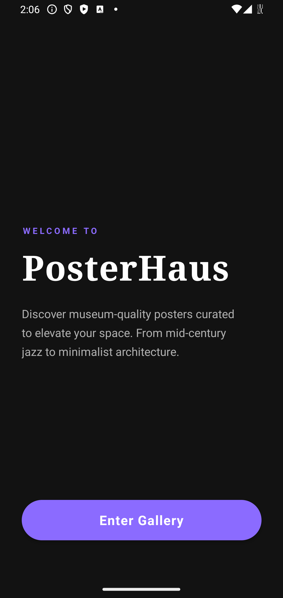
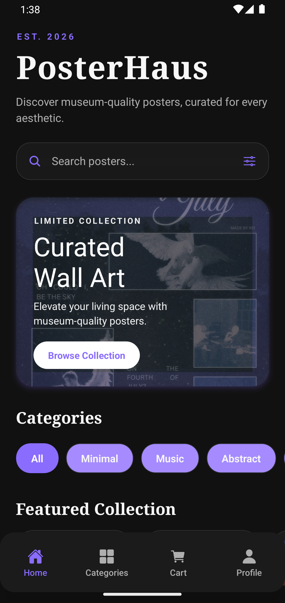
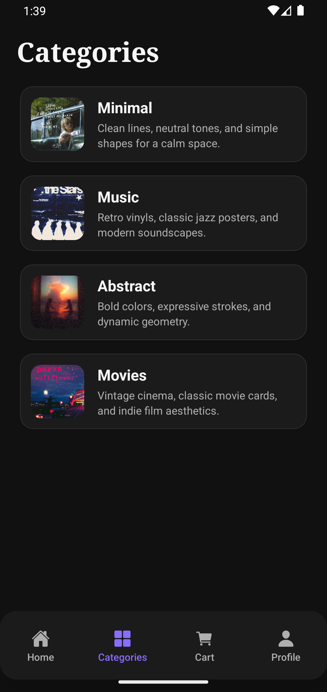
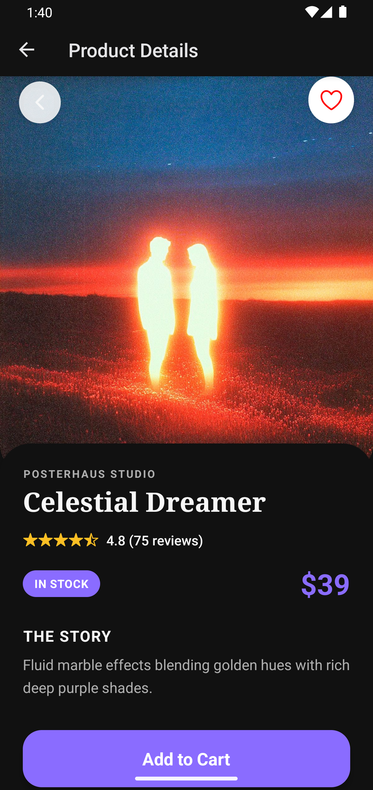
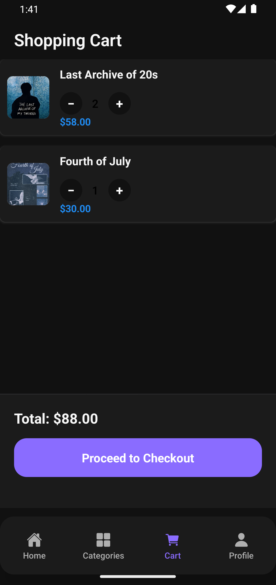
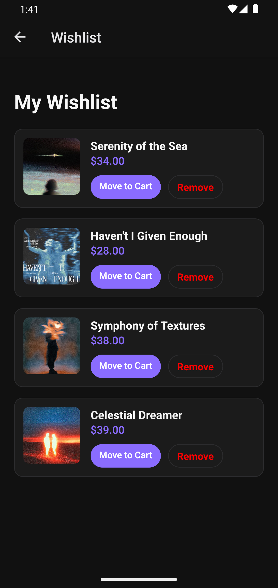
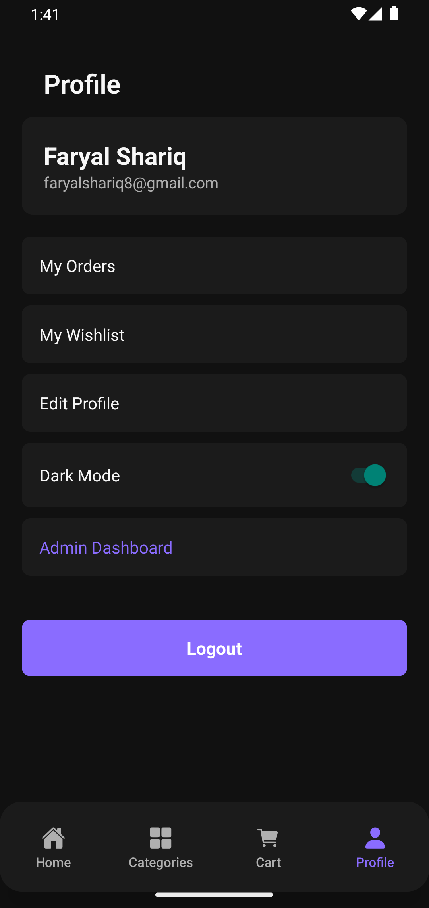
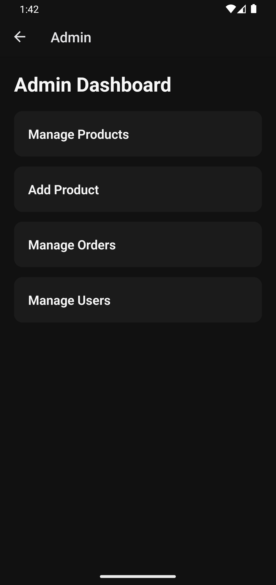

# PosterHaus – Mobile E-Commerce Application

## Project Overview

PosterHaus is a full-stack mobile e-commerce application developed using **React Native (Expo)** for the frontend and **Node.js, Express.js, and MongoDB** for the backend.

The application allows users to browse posters, manage a shopping cart and wishlist, place orders, and securely authenticate using JWT. It also includes an admin dashboard for managing products, categories, users, and orders.


## Features

- User Authentication
- Browse Products
- Search Products
- Category Filtering
- Wishlist
- Shopping Cart
- Order Placement
- Order History
- Profile Management
- Admin Dashboard
- Dark/Light Theme
- Password Reset via Email (Resend)


## APK

The Android APK can be downloaded from the **Releases** section of this repository.

Latest release:
- PosterHaus v1.0
Download APK:
https://github.com/faryalshariq8/ecommerce-mobile-app/releases

  
## Application Preview

| Splash | Entry | 
|--------|------|
|  |  |

| Home |
|------|
  |
 
| Categories | Product Details |
|------------|-----------------|
|  |  |

| Cart | Wishlist |
|------|-----------|
|  |  |

| Profile | Admin Dashboard |
|---------|-----------------|
|  |  |


## Technologies Used

### Frontend

* React Native (Expo)
* React Navigation
* Axios
* Zustand (State Management)

### Backend

* Node.js
* Express.js
* MongoDB Atlas
* Mongoose
* JWT Authentication
* Cloudinary (Image Storage)
* Stripe (Payment Integration)
* Resend (Password Reset Emails)


## Features

### User

* User Registration
* User Login
* JWT Authentication
* Browse Products
* Search Products
* Browse Categories
* Wishlist
* Shopping Cart
* Checkout
* Order History
* Profile Management
* Dark / Light Theme
* Forgot Password Email

### Admin

* Dashboard
* Product Management
* Category Management
* User Management
* Order Management


## Project Structure

```
backend/
    controllers/
    models/
    routes/
    middleware/
    config/
    utils/

frontend_new/
    src/
        screens/
        components/
        navigation/
        services/
        store/
        constants/
```


## Setup Instructions

### 1. Clone Repository

```
git clone <repository-link>
```


### 2. Backend Setup

Navigate to backend folder:

```
cd backend
```

Install dependencies:

```
npm install
```

Create a `.env` file containing:

```
MONGO_URI=your_mongodb_connection_string

JWT_SECRET=your_jwt_secret

STRIPE_SECRET_KEY=your_stripe_secret

CLOUDINARY_CLOUD_NAME=your_cloud_name
CLOUDINARY_API_KEY=your_api_key
CLOUDINARY_API_SECRET=your_api_secret

RESEND_API_KEY=your_resend_api_key
```

Run backend:

```
npm run dev
```

or

```
npm start
```


### 3. Frontend Setup

Navigate to frontend:

```
cd frontend_new
```

Install dependencies:

```
npm install
```

Update API URL inside:

```
src/services/api.js
```

Run application:

```
npx expo start
```

or

```
npx expo run:android
```


## APK

A release APK is included in the repository for testing on Android devices.


## Test Account

Admin:

```
Email:
faryalshariq8@gmail.com

Password:
fari123
```

User:
You can create your own account.

## Developed By

Faryal Shariq

BS Computer Science Final Year Project
